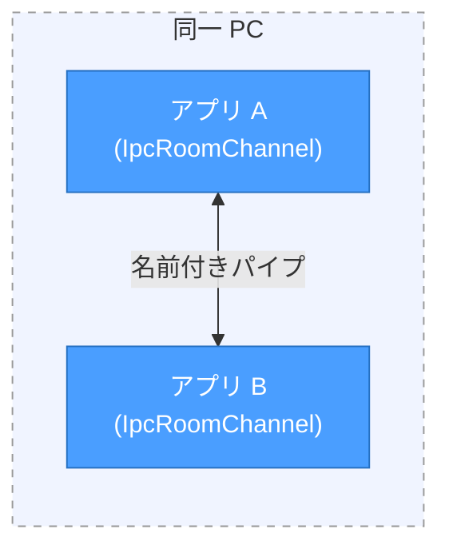
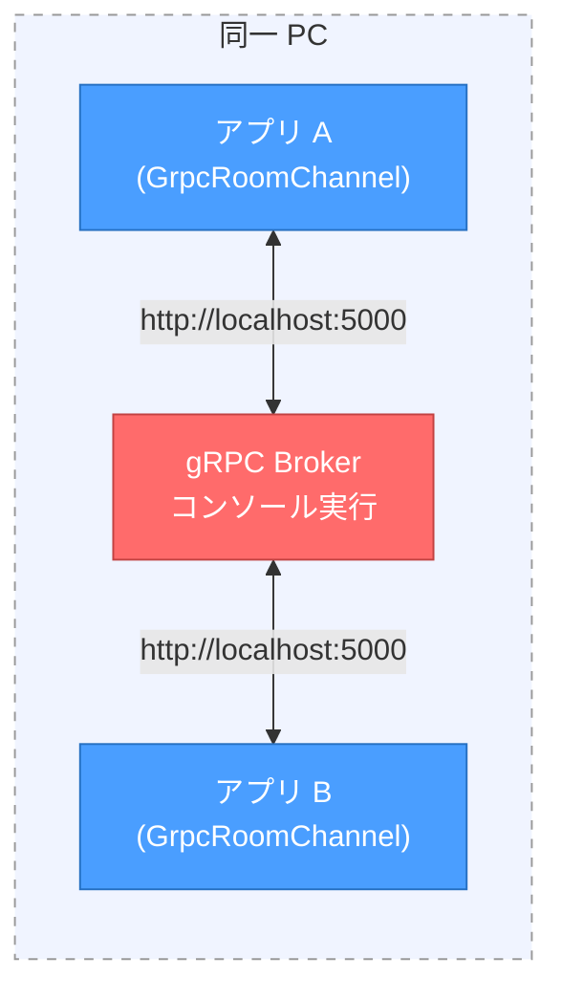
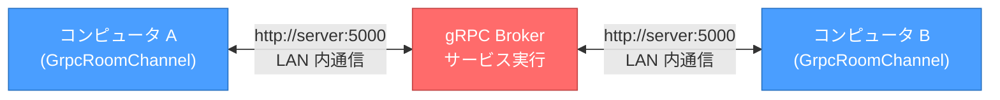
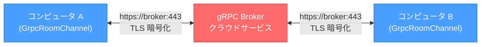

# RCOM

Remote Communication Framework — gRPC / IPC ベースのリモート通信ライブラリ

## 概要

RCOM は、gRPC 双方向ストリーミングおよび名前付きパイプ（IPC）を利用したリモート通信フレームワークです。
2 つのレイヤーで構成されており、トランスポート層を差し替えることで、インターネット越しの通信も同一 PC 内のプロセス間通信も同じ API で実現できます。

| レイヤー | プロジェクト | 役割 |
|---|---|---|
| Layer 2 | `RCOM.Rpc` | JSON-RPC 2.0 による 1:1 リクエスト/レスポンス通信 |
| Layer 1 | `RCOM.Channel` | トランスポート層（gRPC / IPC）による汎用メッセージ送受信 |

```
┌─────────────────────────────────┐
│  あなたのアプリケーション        │
├─────────────────────────────────┤
│  Layer 2: RCOM.Rpc (RemotePeer) │  ← JSON-RPC 2.0 で通信
├─────────────────────────────────┤
│  Layer 1: RCOM.Channel          │  ← トランスポート層
│    ├ GrpcRoomChannel            │  ← gRPC ストリーミング（リモート通信）
│    └ IpcRoomChannel             │  ← 名前付きパイプ（PC 内 IPC）
├─────────────────────────────────┤
│  gRPC / Broker サーバー          │  ← gRPC 使用時のみ
└─────────────────────────────────┘
```

通常は **Layer 2（`RemotePeer`）** のみを使用します。Layer 1 の存在を意識する必要はありません。

---

## 運用パターン

RCOM はトランスポート層の差し替えにより、さまざまな運用形態に対応できます。

### パターン 1: IPC によるPC ローカルのプロセス間通信

同一 PC 内の 2 つのプロセスが名前付きパイプで直接通信します。サーバー不要で最もシンプルな構成です。



### パターン 2: gRPC サーバーをコンソール実行した通信

同一 PC 上で gRPC Broker をコンソールアプリとして起動し、2 つのクライアントが接続します。開発・デバッグに最適です。



### パターン 3: ローカルネットワーク上での通信

LAN 内のサーバーマシンで gRPC Broker を Windows サービスまたは Linux デーモンとして常時稼働させ、ネットワーク内の PC 間で通信します。



### パターン 4: クラウドサービスによるインターネット越しの通信

クラウド（GCP, AWS 等）に gRPC Broker をデプロイし、インターネット越しに通信します。TLS による暗号化で安全に通信できます。



### パターン比較

| パターン | トランスポート | サーバー | TLS | 用途 |
|---|---|---|---|---|
| 1. IPC | 名前付きパイプ | 不要 | - | 同一 PC 内のプロセス間通信 |
| 2. gRPC ローカル | gRPC (HTTP) | コンソール実行 | なし | 開発・デバッグ |
| 3. gRPC LAN | gRPC (HTTP) | サービス実行 | 任意 | 社内ネットワーク |
| 4. gRPC クラウド | gRPC (HTTPS) | クラウド | 必須 | インターネット越し |

---

## Layer 2: RemotePeer の使い方

`RemotePeer` は、リモートの相手と 1:1 で JSON-RPC 2.0 通信を行うクラスです。
コンストラクタに `IRoomChannel` の実装を渡すことで、トランスポートを選択できます。

### gRPC で接続（インターネット越し）

```csharp
// マッチングキー（GUID）を共有する 2 者が同じルームに接続される
var channel = await GrpcRoomChannel.CreateAsync(
    matchingKey: "550e8400-e29b-41d4-a716-446655440000",
    host: "broker.example.com",
    port: 443);
var peer = new RemotePeer(channel);
```

### IPC で接続（同一 PC 内のプロセス間通信）

```csharp
// サーバー側（先に待機する側）
var channel = await IpcRoomChannel.CreateServerAsync(pipeName: "my-app-pipe");
var peer = new RemotePeer(channel);

// クライアント側（後から接続する側、別プロセスで実行）
var channel = await IpcRoomChannel.CreateClientAsync(pipeName: "my-app-pipe");
var peer = new RemotePeer(channel);
```

### リモートメソッド呼び出し

接続後の API は gRPC / IPC で共通です。

```csharp
// 相手側のメソッドを呼び出し、結果を受け取る
var response = await peer.CallAsync("Add", new { a = 1, b = 2 });
Console.WriteLine(response.Result); // => 3
```

### タイムアウトの指定

```csharp
// 5 秒以内に応答がなければ TimeoutException がスローされる
var response = await peer.CallAsync(
    "SlowMethod",
    timeout: TimeSpan.FromSeconds(5));
```

### 相手からのリクエストに応答する

相手が `CallAsync` で呼び出したリクエストを受け取り、結果を返します。

```csharp
peer.OnRequest = async (method, @params) =>
{
    if (method == "Add")
    {
        var a = @params["a"].Value<int>();
        var b = @params["b"].Value<int>();
        return new { result = a + b };
    }
    throw new RpcException(-32601, "Method not found");
};
```

### 一方向通知の送受信

応答を必要としない通知を送受信します。

```csharp
// 送信（応答なし）
await peer.NotifyAsync("Log", new { message = "hello" });

// 受信
peer.OnNotify = (method, @params) =>
{
    Console.WriteLine($"通知: {method}");
};
```

### エラーハンドリング

```csharp
try
{
    var response = await peer.CallAsync("FailingMethod");
}
catch (RpcException ex)
{
    Console.WriteLine(ex.RpcError.Code);    // エラーコード
    Console.WriteLine(ex.RpcError.Message); // エラーメッセージ
}
```

### 切断検知（OnPeerLeave）

相手が切断したとき（Dispose による正常切断・プロセス終了による異常切断の両方）に通知を受け取れます。

```csharp
peer.OnPeerLeave = () =>
{
    Console.WriteLine("相手が切断しました");
    peer.Dispose();
};
```

### 破棄

```csharp
peer.Dispose();
```

---

## Layer 1: RoomChannel の使い方

通常は Layer 2 経由で使用するため、直接操作する必要はありません。
ただし、独自のプロトコルを実装したい場合や、ブロードキャスト通信を行いたい場合は Layer 1 を直接使用できます。

### トランスポートの種類

| 実装クラス | トランスポート | 用途 |
|---|---|---|
| `GrpcRoomChannel` | gRPC 双方向ストリーミング | インターネット越しのリモート通信（Broker サーバー経由） |
| `IpcRoomChannel` | 名前付きパイプ | 同一 PC 内のプロセス間通信（サーバー不要） |

### チャネルモード（gRPC のみ）

gRPC 接続時には 2 つのモードを選択できます。

| モード | 最大人数 | 用途 |
|---|---|---|
| `Peer` | 2 名 | 1:1 通信（Layer 2 はこのモードを使用） |
| `Group` | 無制限 | ブロードキャスト通信 |

IPC は常に 1:1（Peer 相当）です。

### gRPC で直接接続

```csharp
// Peer モード（1:1）
var channel = await GrpcRoomChannel.CreateAsync(
    matchingKey: "550e8400-e29b-41d4-a716-446655440000",
    host: "broker.example.com",
    port: 443,
    mode: ChannelMode.Peer);

// Group モード（ブロードキャスト）
var channel = await GrpcRoomChannel.CreateAsync(
    matchingKey: "group-room-key",
    host: "broker.example.com",
    port: 443,
    mode: ChannelMode.Group);
```

### IPC で直接接続

```csharp
// サーバー側
var channel = await IpcRoomChannel.CreateServerAsync("my-pipe");

// クライアント側
var channel = await IpcRoomChannel.CreateClientAsync("my-pipe");
```

### メッセージの送受信

```csharp
// 受信
channel.OnReceived = (payload) =>
{
    Console.WriteLine(payload);
};

// 切断検知
channel.OnDisconnected = () =>
{
    Console.WriteLine("接続が切断されました");
};

// 送信
await channel.SendAsync("{\"type\":\"chat\",\"text\":\"Hello!\"}");
```

### モードの制約（gRPC）

- 同じマッチングキーのルームには、最初に接続したクライアントのモードが適用されます
- 異なるモードで接続を試みるとサーバーからエラーが返されます
- `Peer` モードでは 3 人目以降の接続はサーバーから拒否されます

---

## ブロードキャスト通信の実現

Layer 2（`RemotePeer`）は 1:1 通信のみをサポートしています。
これは JSON-RPC 2.0 のリクエスト/レスポンス対応付けが、1:1 を前提としているためです。

複数人へのブロードキャスト通信が必要な場合は、Layer 1（`GrpcRoomChannel`）を `ChannelMode.Group` で使用し、独自のメッセージプロトコルを実装してください。

```csharp
// 例: Group モードで独自のブロードキャスト通信を実装
var channel = await GrpcRoomChannel.CreateAsync(
    matchingKey: "broadcast-room",
    host: "broker.example.com",
    mode: ChannelMode.Group);

channel.OnReceived = (payload) =>
{
    // 独自のメッセージ形式を解析して処理
    var msg = JsonConvert.DeserializeObject<MyMessage>(payload);
    HandleBroadcast(msg);
};

await channel.SendAsync(JsonConvert.SerializeObject(
    new MyMessage { Type = "announce", Data = "全員へのお知らせ" }));
```

---

## プロジェクト構成

```
CSharpClient/
├── RCOM.Channel/            # Layer 1: トランスポート層
│   ├── Interfaces/
│   │   └── IRoomChannel.cs  # 共通インターフェース
│   ├── Enums/
│   │   └── ChannelMode.cs
│   ├── GrpcRoomChannel.cs   # gRPC 実装
│   └── IpcRoomChannel.cs    # 名前付きパイプ実装
├── RCOM.Rpc/                # Layer 2: JSON-RPC 2.0 通信層
│   ├── Interfaces/
│   │   └── IRemotePeer.cs
│   ├── Models/
│   │   ├── JsonRpcResponse.cs
│   │   └── JsonRpcError.cs
│   └── RemotePeer.cs
├── RCOM.SampleApp/          # サンプルアプリ（gRPC / IPC 両対応）
├── RCOM.Channel.Tests/      # Layer 1 テスト
├── RCOM.Rpc.Tests/          # Layer 2 テスト
└── RCOM13162.slnx
```

## 動作環境

- .NET Framework 4.8
- gRPC (Grpc.Core 2.46.6)
- Newtonsoft.Json 13.0.3
