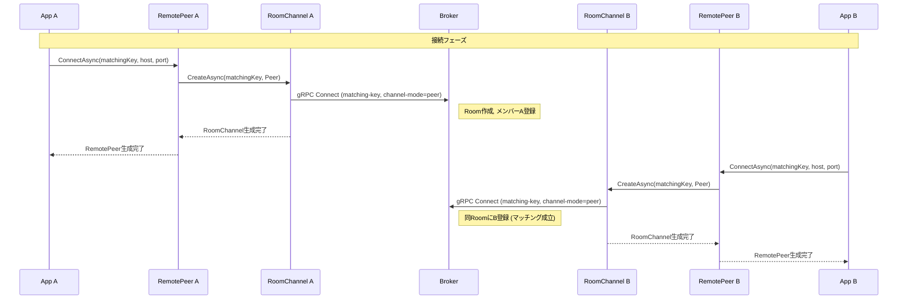
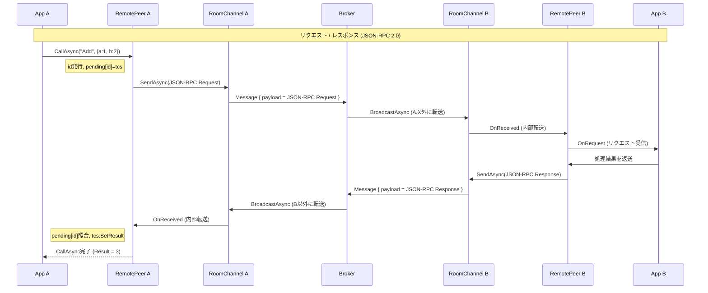
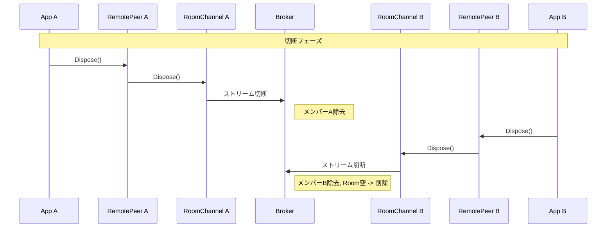
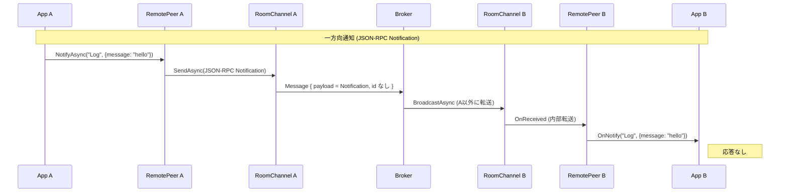

# gRPC ブローカーシステム 設計仕様書

## 目次

1. [概要](#1-概要)
2. [アーキテクチャ](#2-アーキテクチャ)
3. [通信設計](#3-通信設計)
4. [サーバー設計](#4-サーバー設計)
5. [クライアント設計](#5-クライアント設計)
6. [インフラ・運用](#6-インフラ運用)
7. [将来的な拡張方針](#7-将来的な拡張方針)

---

## 1. 概要

### 1.1 目的・背景

PC間のプロセス間通信をインターネット越しに実現するシステム。  
Windows COM技術のActiveX EXE（DCOM）で実現していたプロセス間通信を、現代的な技術スタックでインターネット越しに再実装することを目的とする。

RCOM は、COM/ActiveX の設計思想に敬意を払いつつ、
gRPC を用いてリモート環境へ拡張したプロセス間通信フレームワーク。
RCOM is a remote communication framework inspired by the design philosophy of COM/ActiveX, built on gRPC.

### 1.2 システムの基本コンセプト

- クライアントはあらかじめ取り交わした**マッチングキー（GUID）**を使って初期化する
- マッチングキーが同じクライアント同士が同一の**ルーム**に参加する
- ルーム内のメンバーへのメッセージは**ブロードキャスト**で配信される
- クライアントはサーバー（ブローカー）の存在を意識せず、ローカルオブジェクトを呼ぶような感覚で通信できる

```
var channel = await PeerChannel.CreateAsync("your-matching-key-guid");
channel.OnReceived = (message) => { /* 受信処理 */ };
await channel.SendAsync("Hello");
```

### 1.3 ActiveX EXE / DCOMとの対比

| 観点 | ActiveX EXE (DCOM) | 本システム |
|---|---|---|
| 通信範囲 | PC内プロセス間 / LAN内 | インターネット越し |
| プロトコル | DCOM (RPC over TCP) | gRPC (HTTP/2 over TLS) |
| 接続設定 | レジストリ・COMカタログ | マッチングキー（GUID） |
| NAT越え | 困難 | 可能（アウトバウンド443番ポート） |
| クライアントの感覚 | ローカルオブジェクト呼び出し | 同左（ラッパークラスで抽象化） |

---

## 2. アーキテクチャ

### 2.1 システム全体図

```
クライアントA                  サーバー（ブローカー）               クライアントB
┌──────────────┐              ┌─────────────────────┐             ┌──────────────┐
│              │              │                     │             │              │
│ PeerChannel  │──gRPC(TLS)──→│   BrokerService     │──gRPC(TLS)─→│ PeerChannel  │
│              │              │                     │             │              │
│ Layer3: App  │              │   RoomRegistry      │             │ Layer3: App  │
│ Layer2: RPC  │              │   Room              │             │ Layer2: RPC  │
│ Layer1: Ch   │              │                     │             │ Layer1: Ch   │
└──────────────┘              └─────────────────────┘             └──────────────┘
```

### 2.2 レイヤー構成

```
┌─────────────────────────────────────────┐
│  Layer 3: アプリケーション層              │
│  ビジネスロジック                         │
├─────────────────────────────────────────┤
│  Layer 2: RPC層                          │
│  JSON-RPC 2.0フォーマット                 │
│  IDマッチング／タイムアウト管理            │
├─────────────────────────────────────────┤
│  Layer 1: チャネル層                     │
│  gRPC双方向ストリーミング                  │
│  マッチングキーによるペアリング            │
│  再接続管理                              │
└─────────────────────────────────────────┘
```

各層の責務を明確に分離することで、本番移行時にLayer1のみを差し替えられる設計とする。

### 2.3 チャネルモード

Layer1は2つの接続モードをサポートする。モードはクライアントの接続時にヘッダー `channel-mode` で指定し、サーバー側のルームに記録される。

| モード | 最大人数 | 用途 | Layer2対応 |
|---|---|---|---|
| **Peer** | 2 | 1:1 RPC（Request/Response対管理） | あり |
| **Group** | 制限なし | ブロードキャスト通知 | なし（将来対応可） |

#### Peerモードの制約

- ルーム内の参加者は最大2人
- 3人目の接続要求に対してサーバーは `StatusCode.FailedPrecondition` エラーを返す
- Layer2（RemotePeer）はこのモードを前提として動作する

#### モードの競合

- ルーム作成時の最初の接続者が指定したモードがルームのモードとして確定する
- 後続の接続者が異なるモードを指定した場合、サーバーは `StatusCode.FailedPrecondition` エラーを返す

### 2.4 技術選定

#### gRPC採用理由

| 比較軸 | REST API | JSON-RPC 2.0 | gRPC |
|---|---|---|---|
| 双方向通信 | 困難 | 困難 | ネイティブ対応 |
| ステートフル | 不可 | 不可 | 可能（ストリーミング） |
| 型安全性 | 低 | 低 | 高（Protocol Buffers） |
| AI向けTool Discovery | 困難 | 困難 | 標準対応 |
| インターネット越し | 可 | 可 | 可（TLS必須） |

双方向ストリーミングとステートフルな接続維持が必要なため、gRPCを採用する。

#### JSON-RPC 2.0をLayer2に採用する理由

gRPCのストリーミングはメッセージの送受信を対で管理する仕組みを持たない。  
リクエストとレスポンスの対管理、IDによるマッチング、タイムアウト管理をLayer2でJSON-RPC 2.0フォーマットを用いて実装する。

```
Layer1（gRPCストリーム）：バイト列／JSON文字列を届けるだけ
Layer2（JSON-RPC 2.0）　：Request/Responseの対管理・タイムアウト
```

---

## 3. 通信設計

### 3.1 プロトコルスタック

```
┌────────────────────────────┐
│ アプリケーションデータ        │
├────────────────────────────┤
│ JSON-RPC 2.0               │  ← Layer2
├────────────────────────────┤
│ gRPC（Protocol Buffers）    │  ← Layer1
├────────────────────────────┤
│ HTTP/2                     │  ← キープアライブ・多重化
├────────────────────────────┤
│ TLS                        │  ← 暗号化
├────────────────────────────┤
│ TCP                        │  ← セッション維持
└────────────────────────────┘
```

### 3.2 Protocol Buffers定義

```protobuf
syntax = "proto3";

service Broker {
    // 双方向ストリーミングで常時接続
    rpc Connect(stream Message) returns (stream Message);
}

message Message {
    string matching_key = 1;   // ルーム識別子（GUID）
    string payload      = 2;   // JSON-RPC 2.0フォーマットのJSON文字列
    string message_id   = 3;   // メッセージ識別子
}
```

### 3.3 JSON-RPC 2.0フォーマット（Layer2）

#### リクエスト

```json
{
  "jsonrpc": "2.0",
  "id": "550e8400-e29b-41d4-a716-446655440000",
  "method": "someMethod",
  "params": {
    "key": "value"
  }
}
```

#### レスポンス（成功）

```json
{
  "jsonrpc": "2.0",
  "id": "550e8400-e29b-41d4-a716-446655440000",
  "result": {
    "key": "value"
  }
}
```

#### レスポンス（エラー）

```json
{
  "jsonrpc": "2.0",
  "id": "550e8400-e29b-41d4-a716-446655440000",
  "error": {
    "code": -32603,
    "message": "Internal error",
    "data": "詳細情報"
  }
}
```

### 3.4 シーケンス図

アプリケーション A, B が Layer 2（RemotePeer）経由で通信する全体フローを示す。
登場するクラスとその責務は以下のとおり。

| 登場者 | 責務 |
|---|---|
| アプリ A / アプリ B | ユーザーのアプリケーションコード |
| RemotePeer A / B | Layer 2 — JSON-RPC 2.0 の Request/Response 対管理 |
| RoomChannel A / B | Layer 1 — gRPC 双方向ストリーミングの送受信 |
| Broker サーバー | ルーム管理とメッセージ中継 |

#### 接続フェーズ



#### リクエスト／レスポンスフェーズ（JSON-RPC 2.0）



#### 切断フェーズ



#### NotifyAsync / OnNotify（一方向通知）



---

## 4. サーバー設計

### 4.1 ルームモデル

マッチングキー単位でルームを管理する。ルームへの参加人数に制限はなく、送信されたメッセージは送信者以外の全メンバーにブロードキャストされる。

```
ルーム: "guid-xxxx-yyyy"
┌──────────────────────────────────┐
│  参加者リスト                     │
│  memberIdA → responseStreamA     │
│  memberIdB → responseStreamB     │
│  memberIdC → responseStreamC     │  ← 3人以上も可
└──────────────────────────────────┘
         ↓ 誰かがSendすると
    送信者以外の全員にブロードキャスト
```

### 4.2 クラス設計

#### Roomクラス

ルーム内のメンバー管理とブロードキャストを担当する。

```csharp
public class Room
{
    // メンバーID → 送信用Stream のマッピング
    private readonly ConcurrentDictionary<Guid, IServerStreamWriter<Message>>
        _members = new();

    /// <summary>
    /// ルームに参加する。メンバーIDを発行して返す。
    /// </summary>
    public Guid Join(IServerStreamWriter<Message> stream)
    {
        var memberId = Guid.NewGuid();
        _members[memberId] = stream;
        return memberId;
    }

    /// <summary>
    /// ルームから退室する。
    /// </summary>
    public void Leave(Guid memberId)
    {
        _members.TryRemove(memberId, out _);
    }

    /// <summary>
    /// 送信者以外の全メンバーにメッセージをブロードキャストする。
    /// Task.WhenAllで並列送信する。
    /// </summary>
    public async Task BroadcastAsync(Guid senderId, Message message)
    {
        var tasks = _members
            .Where(m => m.Key != senderId)
            .Select(m => m.Value.WriteAsync(message).AsTask());

        await Task.WhenAll(tasks);
    }

    /// <summary>
    /// メンバーが0人かどうか。空ルームの削除判定に使用する。
    /// </summary>
    public bool IsEmpty => _members.IsEmpty;
}
```

#### RoomRegistryクラス（デモ環境：インメモリ実装）

全ルームをプロセス内の静的メモリで管理する。

```csharp
public static class RoomRegistry
{
    // マッチングキー（GUID文字列） → Room のマッピング
    // staticなのでプロセス全体で1つだけ存在する
    private static readonly ConcurrentDictionary<string, Room>
        _rooms = new();

    /// <summary>
    /// マッチングキーのルームに参加する。
    /// ルームが存在しない場合は新規作成する。
    /// </summary>
    public static (Room room, Guid memberId) Join(
        string matchingKey,
        IServerStreamWriter<Message> stream)
    {
        // GetOrAddはスレッドセーフ。同時接続でもRoomが二重作成されない。
        var room = _rooms.GetOrAdd(matchingKey, _ => new Room());
        var memberId = room.Join(stream);
        return (room, memberId);
    }

    /// <summary>
    /// マッチングキーのルームから退室する。
    /// ルームが空になった場合はルームごと削除する（メモリリーク防止）。
    /// </summary>
    public static void Leave(string matchingKey, Guid memberId)
    {
        if (!_rooms.TryGetValue(matchingKey, out var room)) return;

        room.Leave(memberId);

        // 空になったルームは削除してメモリを解放する
        if (room.IsEmpty)
            _rooms.TryRemove(matchingKey, out _);
    }
}
```

#### BrokerServiceクラス

gRPCのエンドポイント。クライアントの接続を受け付けRoomRegistryに委譲する。

```csharp
public class BrokerService : Broker.BrokerBase
{
    public override async Task Connect(
        IAsyncStreamReader<Message> requestStream,   // クライアント → サーバー（受信）
        IServerStreamWriter<Message> responseStream, // サーバー → クライアント（送信）
        ServerCallContext context)
    {
        // ヘッダーからマッチングキーを取得
        var matchingKey = context.RequestHeaders
            .GetValue("matching-key")
            ?? throw new RpcException(
                new Status(StatusCode.InvalidArgument,
                    "matching-key header is required"));

        // ルームに参加
        var (room, memberId) = RoomRegistry.Join(matchingKey, responseStream);

        try
        {
            // クライアントからのメッセージを受信し続けるループ
            await foreach (var message in requestStream.ReadAllAsync(
                context.CancellationToken))
            {
                // 受信したメッセージをルーム内の全員にブロードキャスト
                await room.BroadcastAsync(memberId, message);
            }
        }
        catch (RpcException ex) when (ex.StatusCode == StatusCode.Cancelled)
        {
            // クライアントが切断した（正常系）
        }
        finally
        {
            // 切断時の後片付け（例外発生時も必ず実行される）
            RoomRegistry.Leave(matchingKey, memberId);
        }
    }
}
```

### 4.3 スケールアウト方針

#### デモ環境（インメモリ）

```
1インスタンス
┌─────────────────────────────┐
│  RoomRegistry（静的メモリ）  │
│  Dictionary<string, Room>   │
└─────────────────────────────┘
```

#### 本番環境（Redisバックプレーン）

複数インスタンスにスケールアウトする場合、同じマッチングキーのクライアントが異なるインスタンスに振り分けられるとメッセージが届かない問題が発生する。RedisのPub/Sub機能をバックプレーンとして使用することで解決する。

```
┌────────────┐      ┌─────────┐      ┌────────────┐
│ インスタンス1│←───→│  Redis  │←───→│ インスタンス2│
│ clientA接続 │      │Pub/Sub  │      │ clientB接続 │
└────────────┘      │key-xxxx │      └────────────┘
                    └─────────┘
```

インターフェースを切り出すことで差し替えを容易にする。

```csharp
public interface IRoomRegistry
{
    (Room room, Guid memberId) Join(string key, IServerStreamWriter<Message> stream);
    void Leave(string key, Guid memberId);
}

// デモ環境：DIでこちらを注入
public class InMemoryRoomRegistry : IRoomRegistry { ... }

// 本番環境：DIでこちらを注入
public class RedisRoomRegistry : IRoomRegistry { ... }
```

---

## 5. クライアント設計

### 5.1 マッチングキーの役割

- マッチングキーはGUIDを使用し、通常は衝突しないよう設計する
- AとBがマッチングキーを共有する方法はこのシステムではサポートしない（アプリケーション側で解決する）
- マッチングキーはペアリング（シグナリング）に使用し、再接続時にも同じキーで接続する

### 5.2 チャネル層（Layer1）サンプルコード

```csharp
public class PeerChannel
{
    private readonly string _matchingKey;
    private readonly GrpcChannel _grpcChannel;
    private AsyncDuplexStreamingCall<Message, Message>? _call;

    // 受信イベント
    public Action<string> OnReceived { get; set; }

    private PeerChannel(string matchingKey, string serverUrl)
    {
        _matchingKey = matchingKey;
        _grpcChannel = GrpcChannel.ForAddress(serverUrl);
    }

    /// <summary>
    /// マッチングキーで初期化してサーバーに接続する。
    /// </summary>
    public static async Task<PeerChannel> CreateAsync(
        string matchingKey,
        string serverUrl = "https://your-server.example.com")
    {
        var channel = new PeerChannel(matchingKey, serverUrl);
        await channel.ConnectAsync();
        return channel;
    }

    private async Task ConnectAsync()
    {
        var client = new Broker.BrokerClient(_grpcChannel);

        // マッチングキーをヘッダーに付与して接続
        var headers = new Metadata
        {
            { "matching-key", _matchingKey }
        };

        _call = client.Connect(headers);

        // 受信ループをバックグラウンドで開始
        _ = Task.Run(async () =>
        {
            await foreach (var message in _call.ResponseStream.ReadAllAsync())
            {
                OnReceived?.Invoke(message.Payload);
            }
        });
    }

    /// <summary>
    /// ルーム内の全員にメッセージを送信する。
    /// </summary>
    public async Task SendAsync(string payload)
    {
        if (_call == null) throw new InvalidOperationException("Not connected");

        await _call.RequestStream.WriteAsync(new Message
        {
            MatchingKey = _matchingKey,
            Payload = payload,
            MessageId = Guid.NewGuid().ToString()
        });
    }
}
```

### 5.3 RPC層（Layer2）サンプルコード

JSON-RPC 2.0フォーマットによるRequest/Response対管理とタイムアウト制御。
受信メッセージは `method` フィールドの有無でリクエスト/レスポンスを判別し、`id` フィールドの有無でリクエスト/通知を判別する。

```csharp
public class RemotePeer
{
    private readonly IRoomChannel _channel;

    // 送信中のリクエストをIDで管理
    private readonly ConcurrentDictionary<string, TaskCompletionSource<JsonRpcResponse>>
        _pending = new();

    // 相手からのリクエスト受信ハンドラ（単一デリゲート）
    public Func<string, JToken, Task<object>> OnRequest { get; set; }

    // 相手からの一方向通知受信ハンドラ（単一デリゲート）
    public Action<string, JToken> OnNotify { get; set; }

    public RemotePeer(IRoomChannel channel)
    {
        _channel = channel;
        _channel.OnReceived = OnReceived;
    }

    /// <summary>
    /// リモートメソッドを呼び出し、レスポンスを待つ（JSON-RPC Request: id あり）。
    /// </summary>
    public async Task<JsonRpcResponse> CallAsync(
        string method,
        object? @params = null,
        TimeSpan timeout = default)
    {
        var id = Guid.NewGuid().ToString();
        var tcs = new TaskCompletionSource<JsonRpcResponse>();
        _pending[id] = tcs;

        var request = JsonConvert.SerializeObject(new
        {
            jsonrpc = "2.0",
            id,
            method,
            @params
        });

        await _channel.SendAsync(request);

        var effectiveTimeout = timeout == default ? TimeSpan.FromSeconds(30) : timeout;
        using var cts = new CancellationTokenSource(effectiveTimeout);
        cts.Token.Register(() =>
        {
            if (_pending.TryRemove(id, out var t))
                t.SetException(new TimeoutException($"RPC timeout: {method}"));
        });

        return await tcs.Task;
    }

    /// <summary>
    /// 一方向通知を送信する（JSON-RPC Notification: id なし、応答なし）。
    /// </summary>
    public Task NotifyAsync(string method, object? @params = null)
    {
        var notification = JsonConvert.SerializeObject(new
        {
            jsonrpc = "2.0",
            method,
            @params
        });

        return _channel.SendAsync(notification);
    }

    private void OnReceived(string json)
    {
        var msg = JsonConvert.DeserializeObject<JsonRpcMessage>(json);
        if (msg == null) return;

        if (msg.Method != null)
        {
            // method あり → リクエストまたは通知
            if (msg.Id == null)
                OnNotify?.Invoke(msg.Method, msg.Params);  // id なし → 通知
            else
                HandleRequestAsync(msg);                     // id あり → リクエスト
        }
        else if (msg.Id != null && _pending.TryRemove(msg.Id, out var tcs))
        {
            // method なし → レスポンス（CallAsync の返信）
            if (msg.Error != null)
                tcs.SetException(new RpcException(msg.Error));
            else
                tcs.SetResult(new JsonRpcResponse { Id = msg.Id, Result = msg.Result });
        }
    }

    private async void HandleRequestAsync(JsonRpcMessage request)
    {
        try
        {
            var result = await OnRequest(request.Method, request.Params);
            await _channel.SendAsync(JsonConvert.SerializeObject(new
            {
                jsonrpc = "2.0",
                id = request.Id,
                result
            }));
        }
        catch (Exception ex)
        {
            await _channel.SendAsync(JsonConvert.SerializeObject(new
            {
                jsonrpc = "2.0",
                id = request.Id,
                error = new { code = -32603, message = ex.Message }
            }));
        }
    }
}
```

#### 受信メッセージの判定フロー

```
受信 JSON
  │
  ├─ "method" あり → リクエストまたは通知
  │   ├─ "id" あり → OnRequest(method, params) → 応答を自動返送
  │   └─ "id" なし → OnNotify(method, params)
  │
  └─ "method" なし → レスポンス（CallAsync への返信）
      └─ pending[id] にマッチ → tcs.SetResult
```

### 5.4 アプリケーション層（Layer3）利用例

```csharp
// マッチングキーで接続するだけ（RoomChannelの存在を意識しない）
var peer = await RemotePeer.ConnectAsync(
    "550e8400-e29b-41d4-a716-446655440000",
    "your-server.example.com");

// 相手からのリクエストに応答する
peer.OnRequest = async (method, @params) =>
{
    if (method == "Add")
    {
        var a = @params["a"].Value<int>();
        var b = @params["b"].Value<int>();
        return new { result = a + b };
    }
    throw new RpcException(-32601, "Method not found");
};

// 相手からの一方向通知を受け取る
peer.OnNotify = (method, @params) =>
{
    Console.WriteLine($"通知受信: {method}");
};

// リモートメソッド呼び出し（レスポンスを待つ）
var response = await peer.CallAsync("doSomething", new { value = 42 });

// 一方向通知を送る（応答なし）
await peer.NotifyAsync("Log", new { message = "hello" });
```

---

## 6. インフラ・運用

### 6.1 デモ環境（GCP Compute Engine Always Free）

GCPのAlways Free枠を使い無料で常時稼働させる。

| リソース | 内容 |
|---|---|
| VM | e2-micro（vCPU×2共有、メモリ1GB） |
| ディスク | 標準永続ディスク 30GBまで無料 |
| 外部IP | エフェメラルIP（起動のたびに変わる） |
| アウトバウンド通信 | 1GB/月まで無料 |
| リージョン | us-central1 / us-west1 / us-east1のいずれか |

#### セットアップ手順

無料運用参考サイト
https://qiita.com/muhi111/items/24b881975f98e0409ef7

```bash
# 1. GCP CLI をインストール（未導入の場合）
winget install Google.CloudSDK

# 2. インストール確認
gcloud --version

# 3. GCP CLIで e2-micro VMを作成（無料枠: e2-micro + pd-standard + us-central1）
gcloud compute instances create grpc-broker --project=grpcbroker --zone=us-central1-a --machine-type=e2-micro --tags=https-server,http-server --create-disk=auto-delete=yes,boot=yes,device-name=grpc-broker,image=projects/debian-cloud/global/images/debian-12-bookworm-v20260210,mode=rw,size=10,type=pd-standard

# 4. ファイアウォールでポートを開放
gcloud compute firewall-rules create allow-grpc --project=grpcbroker --allow=tcp:443,tcp:5000 --target-tags=http-server

# 5. SSHで接続
gcloud compute ssh grpc-broker --zone=us-central1-a

# 6. .NET 10 ランタイムをインストール（Debian 12 は Microsoft リポジトリの追加が必要）
wget https://packages.microsoft.com/config/debian/12/packages-microsoft-prod.deb -O packages-microsoft-prod.deb
sudo dpkg -i packages-microsoft-prod.deb && rm packages-microsoft-prod.deb
sudo apt-get update
sudo apt-get install -y aspnetcore-runtime-10.0

# 7. アプリをビルドして転送（ローカルPCで実行）
dotnet publish -c Release -o ./publish
gcloud compute ssh grpc-broker --zone=us-central1-a --command="sudo rm -rf ~/app && mkdir ~/app"
gcloud compute scp --recurse ./publish/* grpc-broker:/home/jun8k/app --zone=us-central1-a

# 8. systemdで自動起動設定
sudo nano /etc/systemd/system/grpc-broker.service
```

```ini
# /etc/systemd/system/grpc-broker.service
[Unit]
Description=gRPC Broker Service
After=network.target

[Service]
WorkingDirectory=/home/jun8k/app
Environment=ASPNETCORE_URLS=http://0.0.0.0:5000
ExecStart=/usr/bin/dotnet /home/jun8k/app/gRpcBroker.dll
Restart=always
RestartSec=10

[Install]
WantedBy=multi-user.target
```

```bash
sudo systemctl enable grpc-broker
sudo systemctl start grpc-broker
```

#### 使わない時の運用

```bash
# 停止（コンピュート課金が止まる）
gcloud compute instances stop grpc-broker --zone=us-central1-a

# 起動
gcloud compute instances start grpc-broker --zone=us-central1-a
```

> **注意：** エフェメラルIPを使う場合、起動のたびにIPアドレスが変わる。  
> デモ時は起動後に `gcloud compute instances describe grpc-broker --zone=us-central1-a` でIPを確認する。

### 6.2 本番環境の選択肢

| 構成 | 内容 | 特徴 |
|---|---|---|
| GCP Cloud Run + Redis | コンテナ＋Memorystore | gRPCストリーミング対応、オートスケール |
| AWS ECS Fargate + ElastiCache | コンテナ＋Redis | AWSに慣れたチーム向け |
| GCP GKE + Redis | Kubernetes＋Redis | 大規模向け |

### 6.3 ネットワーク要件

#### ポート番号

| ポート | 用途 | 推奨理由 |
|---|---|---|
| 443 | gRPC over TLS | ほぼすべての環境で通過できる |
| 50051 | gRPCデフォルト | 企業FWでブロックされる場合がある |

**443番ポートを使うことを強く推奨する。**

#### クライアント施設側の要件

一般的な環境では特別な対応は不要。

| 環境 | 対応 |
|---|---|
| 一般家庭・通常のオフィス | 不要 |
| 443番ポート使用時 | ほぼすべての環境で通過 |
| 厳格なプロキシ環境 | HTTP/2対応プロキシが必要（ネットワーク管理者に確認） |

#### キープアライブとNAT

HTTP/2はPINGフレームによるキープアライブを自動的に行う。これはアプリケーションコードが意識する必要はない。

```
PINGフレームのサイズ：約17バイト（ヘッダー9 + ペイロード8）
送信間隔：数十秒〜数分に1回（gRPCランタイムが自動管理）
100クライアント接続時の通信量：約3KB/分（ルーターへの影響は無視できるレベル）
```

HTTP/2はTCPセッションを多重化するため、クライアント1台あたりのTCPセッション数は原則1つ。ルーターのNATテーブルへの負荷は従来のHTTP/1.1より少ない。

---

## 7. 将来的な拡張方針

### 7.1 Redisバックプレーンへの移行

`IRoomRegistry`インターフェースの実装を差し替えるだけで移行できる設計とする。`BrokerService`のコードは変更不要。

```csharp
// デモ環境
builder.Services.AddSingleton<IRoomRegistry, InMemoryRoomRegistry>();

// 本番環境（変更箇所はここだけ）
builder.Services.AddSingleton<IRoomRegistry, RedisRoomRegistry>();
```

### 7.2 未到達メッセージへの対応

現バージョンでは**対象外**とする。片方が切断中の間のメッセージは破棄される。  
将来的に必要になった場合はLayer1とLayer2の間にキュー層（Redis Streams等）を差し込む設計で対応可能。

```
現在：Layer1（gRPC）→ Layer2（JSON-RPC 2.0）
将来：Layer1（gRPC）→ キュー層（Redis Streams）→ Layer2（JSON-RPC 2.0）
```

### 7.3 認証・セキュリティの強化

現バージョンではマッチングキーのみで認証を行う。本番運用では以下の対応を検討する。

- マッチングキーの有効期限管理
- JWTによるクライアント認証
- ルーム参加人数の上限設定
- レートリミット
